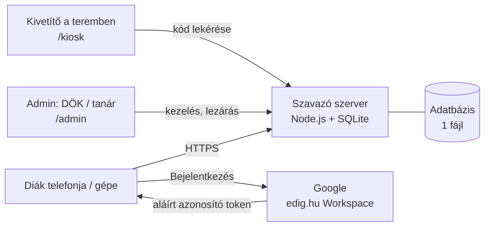
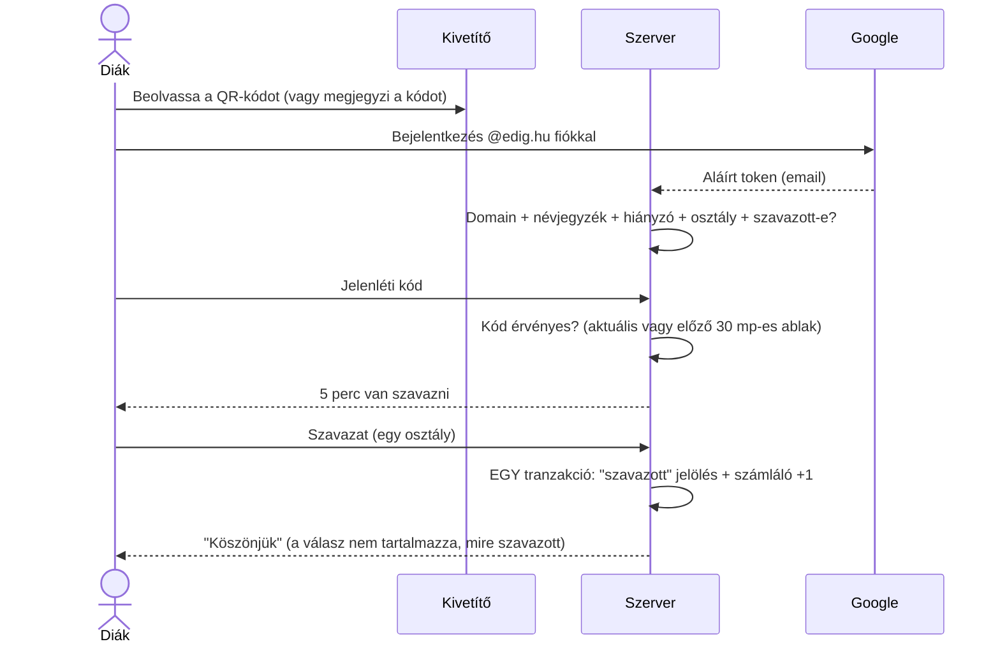

# Rendszerleírás – elektronikus diáknapi szavazás

**Dobó István Gimnázium, Eger** · Tervezet, v0.2 · 2026. október

Ez a dokumentum leírja, hogyan működik a rendszer, miért így, és mit nem tud (még). Célja, hogy a DÖK, a DÖK-segítő tanár, az igazgatóság és a rendszergazda egy dokumentumból el tudja dönteni, használható-e a rendszer, és milyen feltételekkel.

---

## 1. Háttér és cél

A diáknapon a 11. évfolyam osztályai kampányolnak, a diákok egy osztályra szavaznak, a legtöbb szavazatot kapott osztály nyer. Eddig papíron szavaztunk, a számlálást az igazgató, a helyettesek és a versengő osztályok osztályfőnökei végezték – ez hiteles, de akár 2 óránál is tovább tart.

A cél egy olyan elektronikus rendszer, amely **legalább olyan hiteles, mint a papír**, de az eredmény a lezárás után másodperceken belül megvan.

## 2. Követelmények és megoldásuk

| # | Követelmény | Megoldás a rendszerben |
|---|---|---|
| K1 | Csak dobós diák és tanár szavazhat | Google-bejelentkezés, a szerver ellenőrzi, hogy a fiók `@edig.hu` Workspace-fiók **és** szerepel a névjegyzékben (a tanárok külön csoportként) |
| K2 | Csak aki aznap jelen van | Hiányzók listája (admin feltölti), a hiányzó nem szavazhat |
| K3 | Csak az iskolából | A teremben kivetített, 30 mp-enként változó **jelenléti kód** (+ opcionálisan: csak az iskolai hálózatról) |
| K4 | Mindenki csak egyszer | Adatbázis-kényszer: egy email egy szavazáson egyszer szerepelhet a „szavazott” listában |
| K5 | Anonim | A „ki szavazott” és a „mire szavaztak” külön táblában, köztük semmilyen kapcsolat (se idő, se sorszám) |
| K6 | Hiteles | Eredmény csak lezárás után látható; automatikus egyezés-ellenőrzés; jegyzőkönyv lenyomattal; nyílt forráskód |
| K7 | Stabil | Egyszerű, kevés függőségű rendszer; 550 fő terhelése elhanyagolható; próbakör; papíros tartalékterv |
| K8 | Próbakör | Szavazásonként megadható, mely osztályok szavazhatnak |

### Miért nem helymeghatározás (GPS)?

Az első ötlet a böngészős helymeghatározás volt. Elvetettük, mert:

- **Épületen belül pontatlan:** a GPS bent 20–50 métert is tévedhet, a wifi alapú helymeghatározás még rosszabb lehet. Jogos szavazókat zárna ki, vagy a szomszéd utcából is engedne.
- **Könnyen hamisítható:** a böngésző fejlesztői eszközeiben pár kattintással tetszőleges hely beállítható. Egy vitatott eredménynél ez lenne a gyenge pont.
- **Sok telefonon nem is működik** (kikapcsolt helyszolgáltatás, böngészőengedélyek).
- **Adatvédelem:** kiskorúak pontos helyadatát kellene kezelni, erre nincs szükség.

A jelenléti kód ugyanazt a célt szolgálja: csak az tud szavazni, aki a teremben látja a kivetítőt.

## 3. Architektúra

- **Szerver:** Node.js (Express), egyetlen folyamat.
- **Adatbázis:** SQLite, egyetlen fájl. 550 szavazóhoz bőven elég, és a mentés egy fájl másolása.
- **Bejelentkezés:** „Bejelentkezés Google-fiókkal” (OpenID Connect). A szerver csak az email címet és a nevet kapja meg, a diák semmilyen más Google-adatához nem fér hozzá (nincs Drive-, Gmail- stb. hozzáférés).
- **Három felület:**
  - `/` – szavazóoldal (mobilra optimalizálva)
  - `/kiosk` – kivetítő: nagy jelenléti kód + QR-kód
  - `/admin` – névjegyzék, hiányzók, szavazások kezelése, jegyzőkönyv

## 4. A szavazás menete

1. A diák a teremben beolvassa a kivetített QR-kódot (ez megnyitja az oldalt a kóddal együtt), vagy megnyitja az oldalt és beírja a 6 jegyű kódot.
2. Belép az iskolai Google-fiókjával.
3. A szerver ellenőrzi: `@edig.hu` fiók, szerepel a névjegyzékben, nem hiányzó, az osztálya szavazhat ebben a körben, még nem szavazott.
4. Érvényes kód után 5 perce van szavazni (beállítható).
5. Kiválaszt egy osztályt, megerősíti („Leadás után nem módosítható”).
6. A szavazat rögzül, a diák „Köszönjük” üzenetet kap.

## 5. Adatmodell és anonimitás

| Tábla | Tartalma | Mit **nem** tartalmaz |
|---|---|---|
| `voters` | email, osztály, hiányzik-e | – |
| `voted` | szavazás azonosító, email | **nincs** benne választás, **nincs** időpont, **nincs** sorszám |
| `tally` | szavazás azonosító, jelölt, darabszám | **nincs** benne email, idő vagy sorrend – csak számlálók |
| `elections`, `candidates` | szavazás adatai, jelöltek, lezáráskor a jegyzőkönyv | – |
| `sessions` | bejelentkezési munkamenetek | választás |
| `audit_log` | admin műveletek (ki nyitotta, zárta stb.) | **szavazatokról semmi** |

**Miért anonim?** A szavazatokat nem egyenként tároljuk, hanem csak számlálókat növelünk (`11.B: 147`). Ebből semmilyen módon nem állapítható meg utólag, ki mire szavazott – nincs mit összepárosítani. A `voted` tábla belső sorszám nélküli (`WITHOUT ROWID`), így még a szavazás sorrendje sem olvasható ki belőle. Ezt automata teszt is ellenőrzi: nincs olyan tábla, amelyben email és jelölt együtt szerepel.

**Miért nem lehet dupla vagy elveszett szavazat?** A „szavazott” bejegyzés és a számláló növelése **egyetlen adatbázis-tranzakció**: vagy mindkettő megtörténik, vagy egyik sem. Ha valaki kétszer kattint, vagy két eszközről egyszerre próbál szavazni, az adatbázis a másodikat elutasítja (tesztelve 50 egyidejű kéréssel).

**Naplózás:** a szerver szándékosan nem naplózza a kérések tartalmát, így a választás naplófájlba sem kerülhet.

## 6. Jelenlét ellenőrzése

### Jelenléti kód
- A kivetítőn (`/kiosk`) egy 6 jegyű kód látszik, ami **30 másodpercenként változik**; mellette QR-kód, ami a kóddal együtt nyitja meg a szavazóoldalt.
- A kódot a szerver egy titkos kulcsból számolja (a bankos kétlépcsős azonosítással azonos elven, TOTP-szerűen), előre nem kitalálható.
- Az aktuális és az előző kódot fogadja el (kb. 30–60 mp), hogy a beírás közbeni váltás ne okozzon gondot. A kód szóközzel is beírható („947 969”).
- **QR-kóddal:** a beolvasás pillanatát a szerver aláírva rögzíti, és a Google-belépés *után* azt ellenőrzi, hogy a kód a beolvasáskor érvényes volt-e. Így a lassabb belépés (fiókválasztás, jelszó) alatt sem jár le a kód – erre 3 perc van. A beolvasás egyszer használható, és belépés nélkül nem derül ki, hogy a kód helyes volt-e (nem lehet vele találgatni).
- 5 hibás próbálkozás után 5 perc zárolás (a találgatás ellen).
- A kivetítő oldalt egy kulccsal (vagy admin belépéssel) lehet megnyitni.

### Opcionális: csak az iskolai hálózatról
Ha az iskola internetkapcsolatának fix nyilvános IP-címe van, a szerver beállítható úgy, hogy csak onnan fogadjon szavazatot (`ALLOWED_IPS`). Ekkor a diákoknak az iskolai wifire kell csatlakozniuk. Ez a jelenléti kód mellé **kiegészítő** védelem, mobilnettel pedig nem lehet megkerülni.

### Ajánlott: felügyelt szavazás
A legerősebb és legegyszerűbben védhető megoldás, ha a szavazás **egy adott időpontban, osztályonként, tanár jelenlétében** történik (pl. egy tanóra első 10 perce), a kivetítőn a kóddal. Ez a papíros „urna” logikáját viszi át: a tanár látja, hogy mindenki magának szavaz.

## 7. Hitelesség – eljárásrend

A rendszer csak akkor hiteles, ha az eljárás is az. Javasolt menet:

**Előtte**
1. A forráskód nyilvános (GitHub), a DÖK-segítő tanár vagy egy informatikatanár átnézheti.
2. Próbakör 1–2 osztállyal (lásd 9. pont).
3. Az éles szavazást az admin **előkészíti**, de csak a kezdés pillanatában **nyitja meg**.

**Közben**
4. Szavazás után a rendszer automatikusan kilépteti a diákot, és a Google automatikus belépését is kikapcsolja – közös gépen (gépterem) a következő diák nem a másik fiókjában folytatja.
5. Az ügyeletes admin diákot kereshet: szerepel-e a névjegyzékben, hiányzónak van-e jelölve (ez azonnal javítható), szavazott-e már. Azt, hogy kire szavazott, a rendszer nem tudja – ez a papíros aláírt névsornak felel meg.
6. A részvétel (hányan szavaztak) élőben látható az adminfelületen, **az eredmény viszont senkinek, adminnak sem**. Ez technikailag is így van: a szerver lezárás előtt nem ad ki eredményt.
7. A névjegyzék nyitott szavazás alatt nem cserélhető.

**Lezárás**
8. A lezárás tanúk előtt történik: igazgató (vagy helyettes) és a versengő osztályok osztályfőnökei – ugyanazok, akik eddig számoltak, csak 2 óra helyett 2 perc.
9. Lezáráskor a rendszer automatikusan elkészíti a **jegyzőkönyvet**:
   - jogosultak száma, szavazók száma, leadott szavazatok száma
   - **egyezés-ellenőrzés:** szavazók száma = szavazatok száma (ha nem egyezik, pirosan jelzi)
   - eredmény jelöltenként, holtverseny jelzése
   - részvétel osztályonként
   - a jegyzőkönyv **SHA-256 lenyomata** (ujjlenyomata): ha utólag bárki egyetlen számot is megváltoztatna, a lenyomat nem egyezne
10. A jegyzőkönyvet kinyomtatják és aláírják; a lenyomat a nyomtatott példányon is szerepel. A jegyzőkönyv JSON-fájlként is letölthető; `npm run verify -- jegyzokonyv-1.json <lenyomat>` bárki gépén ellenőrzi, hogy a fájl egyezik-e az aláírt példánnyal.
11. Ha a DÖK úgy dönt, az admin egy gombbal **kivetítheti az eredményt** (a `/kiosk` oldalon, oszlopdiagrammal), és le is veheti.

## 8. Kockázatok és védekezés

Őszinte lista: mi ellen véd a rendszer, és mi marad kockázat.

| Kockázat | Védelem | Maradék kockázat |
|---|---|---|
| Nem dobós / külsős szavaz | Google-token szerveroldali ellenőrzése + domain + névjegyzék | nincs érdemi |
| Valaki kétszer szavaz | Adatbázis-kényszer, egy tranzakció | nincs érdemi |
| Otthonról szavaz | Jelenléti kód 30 mp-es váltással | Egy bent lévő barát azonnal továbbküldheti a kódot → **ez ellen az IP-szűrés vagy a felügyelt szavazás véd** |
| Más nevében szavaz (elkéri a jelszavát) | – | Ugyanúgy fennáll, mint papíron a „szavazz helyettem” – felügyelt szavazás csökkenti |
| Kód kitalálása | 1 000 000 lehetőség, 5 hiba után zárolás | elhanyagolható |
| Részeredmény kiszivárgása | Az eredmény lezárásig senkinek nem látható | Aki a szerverhez közvetlenül hozzáfér, az adatbázisba beleláthat → lásd lent |
| Anonimitás megsértése | Csak számlálók, nincs idő/sorrend | Aki a szerverhez közvetlenül hozzáfér, **élőben** figyelve a számlálókat és a munkameneteket elméletben összefüggést kereshet → lásd lent |
| Az eredmény utólagos módosítása | Jegyzőkönyv + lenyomat + aláírt nyomtatott példány | A lezárás előtt a szerver üzemeltetője elvileg belenyúlhat → lásd lent |
| Szerver / internet leáll | Egyszerű rendszer, próbakör, mentés | **Papíros tartalékterv** szükséges |
| Kiberbiztonsági hiba | Szerveroldali ellenőrzés mindenhol, CSRF-védelem, szigorú CSP, HSTS, automata tesztek minden változtatásnál (Linux + Windows) | Élesítés előtt érdemes egy második szempár (pl. infótanár) |
| Közös gépen a következő diák a másik fiókjával szavaz | Szavazás után automatikus kiléptetés, Google automatikus belépés kikapcsolása, figyelmeztetés | A Google-fiókból a diáknak magának kell kilépnie – felügyelő tanár figyeljen rá |
| Tömeges belépési / kódkísérlet | Diákonkénti próbálkozás-korlát a kódra | IP alapú korlát szándékosan nincs: az egész iskola egy IP-címről jön, az a jogos diákokat zárná ki |

> **Továbbfejlesztés:** a fenti „maradék kockázatok” közül a kód továbbküldését, a más nevében szavazást, az üzemeltetői összekötést és a leállás miatti keveredést szerkezeti megoldás zárja ki: osztályülés + kettéválasztott hitelesítő és urna vak aláírással. Részletek: [BIZTONSAGI-TERV.md](BIZTONSAGI-TERV.md).

**Az üzemeltető kérdése.** Minden elektronikus szavazásnál kulcskérdés, hogy aki a szervert üzemelteti, elvileg hozzáférhet az adatbázishoz. Ezért javasolt:
- a szervert **ne egy érintett diák** kezelje a szavazás alatt – ideálisan a rendszergazda vagy egy tanár kezében legyen a hozzáférés;
- az éles verzió egy **nyilvános, megjelölt kódverzióból** fusson (GitHub release), így ellenőrizhető, mi fut;
- a szavazás alatt senki ne lépjen be a szerverre.

## 9. Próbakör

A rendszer támogatja, hogy egy szavazáson csak kijelölt osztályok vegyenek részt. A 2026/27-es tanévben két próbaszavazás lesz: egy kicsi, csak elektronikus, és egy iskolai szintű, papírral párhuzamos. Mit mérünk, és milyen feltételek mellett döntünk az éles használatról: [UTEMTERV.md](UTEMTERV.md).

## 10. Üzemeltetés

- **Futtatás:** Node.js 22.13+, `npm install`, `npm start`. Egy olcsó VPS, az iskola saját szervere, vagy bármilyen Node.js-t futtató tárhely megfelel. Lépésről lépésre: [TELEPITES.md](TELEPITES.md) (systemd + Caddy).
- **Állapotfigyelés:** `GET /healthz`.
- **HTTPS kötelező** (Google-bejelentkezés és a biztonságos süti miatt) – pl. Caddy vagy nginx + Let's Encrypt.
- **Terhelés:** 550 diák, még ha egyszerre is szavaznak, néhány száz kérés percenként – ez egy kis szervernek semmi.
- **Mentés:** a szavazás lezárása után az adatbázisfájl (`data/szavazas.db`) másolata.
- **Beállítások:** lásd `.env.example`.

### Tartalékterv
Ha élesben a rendszer nem elérhető (internet, szerver, Google-bejelentkezés), **papíron szavazunk**, a megszokott módon. A papíros szavazólapokat ezért a diáknapra ki kell nyomtatni.

Egy szavazáson belül **mindig egyetlen hivatalos csatorna** van: vagy a papír, vagy az elektronikus. Ha menet közben kell váltani, a teljes szavazás megismétlődik papíron, és a két rendszer eredményét **nem fésüljük össze** (különben valaki mindkettőn szavazhatna). A próbaszavazásokon használt párhuzamos módban is a papír a hivatalos, az elektronikus csak mérés.

## 11. Adatkezelés (GDPR)

- **Tárolt adatok:** diák emailcíme, osztálya, hiányzás aznap, szavazott-e. **Nem tároljuk:** kire szavazott, helyadatot, Google-profiladatot az emailen kívül.
- **Adatkezelő:** az iskola. Az adatkezelési tájékoztatót (vagy a meglévő kiegészítését) az igazgatósággal / adatvédelmi felelőssel egyeztetni kell.
- **Megőrzés:** javaslat – a szavazás után 30 nappal a személyes adatok törlése. Ez az admin felületen egy gombbal megtehető („Személyes adatok törlése”): törli a névjegyzéket, a „ki szavazott” listát és a munkameneteket; a jegyzőkönyv (csak számok) megmarad.

## 12. Ütemterv

A cél a **2027-es diáknap**. Addig: infótanári átnézés, tesztkörnyezet, vezetőségi engedély, két próbaszavazás mérésekkel, majd májusban döntés előre rögzített feltételek alapján. Részletesen: [UTEMTERV.md](UTEMTERV.md).

## 13. Eldöntendő kérdések a DÖK számára

1. **Hol és mikor szavaznak?** Osztályonként tanórán, tanár jelenlétében (ajánlott) / gépteremben / szabadon egy idősávban?
2. **Szavazhatnak-e a 11.-esek a saját osztályukra?** (A rendszer szavazásonként beállíthatóan mindkettőt tudja.)
3. **Ki vezeti a hiányzók listáját** aznap reggel, és honnan (KRÉTA)?
4. **Holtverseny** esetén mi a szabály?
5. **Ki üzemelteti** a szervert a szavazás alatt, és kik a lezárás tanúi?
6. **Legyen-e IP-szűrés** (csak iskolai wifiről)? Ehhez kell: fix nyilvános IP, és elég erős wifi 550 eszközhöz – ha idősávokra bontjuk, kevesebb egyidejű eszköz.
7. **A tanárok is szavaznak.** Nyitott: ugyanannyit ér-e a szavazatuk, mint egy diáké; együtt vagy külön számoljuk-e; szavazhat-e egy osztályfőnök a saját osztályára? (Lásd [BIZTONSAGI-TERV.md](BIZTONSAGI-TERV.md), „Tanárok”.)
